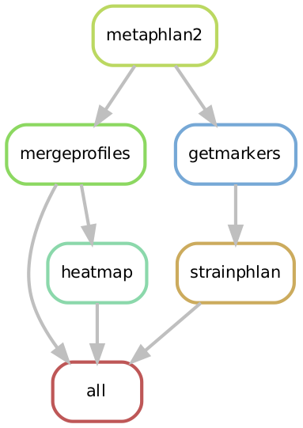

# metprofile

Bioinformatics pipeline for profiling composition of microbial communities from metagenomic shotgun sequencing data using [MetaPhlAn2](https://www.nature.com/articles/nmeth.3802) and [StrainPhlAn](http://segatalab.cibio.unitn.it/tools/strainphlan/).

Note: Am in the process of changing this pipeline from MetaPhlan to Kraken instead. 

## Overview

This pipeline is written in snakemake and designed to automate and control the submission of processes to the Synergy server at the University of Calgary. Developed by Alana Schick for the lab of Dr. Laura Sycuro. 

Input: 

* Paired-end fastq files from shotgun metagenome sequencing.

Output: 

Metaphlan2:

* Table of microbial species and their relative abundance for each sample.
* Heatmap of abundance results.

Strainphlan:

* List of clades detected in samples.
* Phylogenetic trees for all detected species.

## Pipeline summary



### Steps

1) Profile microbial clades and their abundances using MetaPhlAn2. This step generates a table of abundances as well as a heatmap. [MetaPhlAn2 usage](https://bitbucket.org/biobakery/biobakery/wiki/metaphlan2).

2) Identify microbial strains using SNPs in conserved, unique marker genes using StrainPhlAn. [StrainPhlAn usage](https://bitbucket.org/biobakery/biobakery/wiki/strainphlan).

## Installation

To use this pipeline, navigate to your project directory and clone this repository into that directory using the following command:

```
git clone https://github.com/SycuroLab/metprofile.git metprofile
```

Note: you need to have **conda** and **snakemake** installed in order to run this. To install conda, see the instructions [here](https://github.com/ucvm/synergy/wiki). 

To install snakemake using conda, run the following line:

```
conda install -c bioconda -c conda-forge snakemake
```

See the snakemake installation [webpage](https://snakemake.readthedocs.io/en/stable/getting_started/installation.html) for further details.

## Config file

All the parameters required to run this pipeline are specified in a config file, written in yaml. See/modify the provided example file with your custom parameters, called `config.yaml`. This is the only file that should be modified before running the pipeline. Make sure to follow the syntax in the example file in terms of when to use quotations around parameters.

## Data and list of files

Specify the full path to the directory that contains your data files in the config file. You also need to have a list of sample names which contains the names of the samples to run the pipeline on, one sample per line. You can run this pipeline on any number or subset of your samples. Sample names should include everything up to the R1/R2 (or 1/2) part of the file names of the raw fastq files. Specify the path and name of your list in the config file.

If there are many samples, it may be convenient to generate the list of files using the following command, replacing `R1_001.fastq.gz` with the general suffix of your files:

```
ls | grep R1_001.fastq.gz | sed 's/_R1_001.fastq.gz//' > list_files.txt
```

## Description of other parameters
| Parameter | Description |
| -------------- | --------------- |
| list_files | Full path and name of your sample list. |
| path | Location of input files. |

## Running the pipeline on Synergy

Test the pipeline by running `snakemake -np`. This command prints out the commands to be run without actually running them. 

To run the pipeline on the Synergy compute cluster, enter the following command from the project directory:

```
snakemake --cluster-config cluster.json --cluster 'bsub -n {cluster.n} -R {cluster.resources} -W {cluster.walllim} -We {cluster.time} -M {cluster.maxmem} -oo {cluster.output} -e {cluster.error}' --jobs 100 --use-conda
```
The above command submits jobs to Synergy, one for each sample and step of the QC pipeline. Note: the file `cluster.json` contains the parameters for the LSF job submission system that Synergy uses. In most cases, this file should not be modified.

## Results and log files

Snakemake will create a directory for the results of the pipeline as well as a directory for log files. Log files of each step of the pipeline will be written to the `logs` directory.


